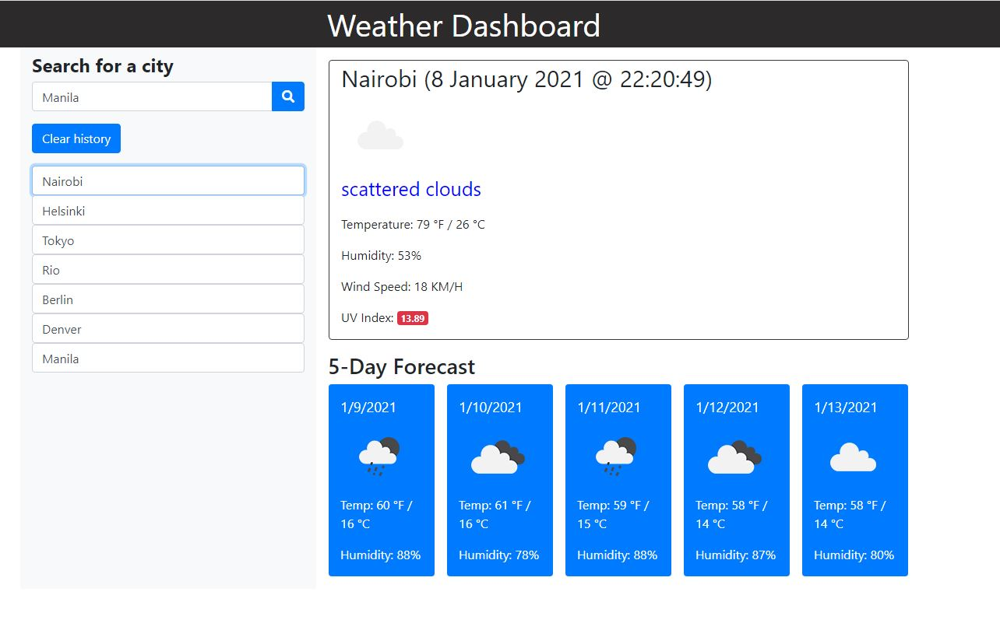

# Weather-Dashboard
This page will enable the users to search for a City then the current weather will be displayed on the right side of the screen and 5 days forecast will be displayed at the bottom of the screen.  An icon with description is also present on the interface.

## Usage
[Weather-Dashboard](https://criscel.github.io/Weather-Dashboard)

## Credits
[Code Validator](https://validator.w3.org/nu/);
[MDN Javascript](https://developer.mozilla.org/en-US/docs/Web/JavaScript);
[W3Scools](https://www.w3schools.com/js/default.asp);
[Font Awesome](https://fontawesome.com/icons/save?style=solid);
[Open Weather API](https://openweathermap.org/)

### Jekyll Themes

This Page uses the layout and styles from the Jekyll that I have selected [Thanks Github! :)

